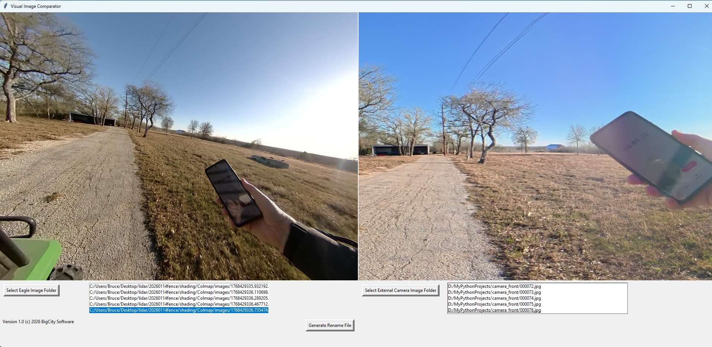

# Visual_Image_Compare
Allows user to visually synchronize images between an Eagle Lidar scanner and an External Camera. 

How to use:
[coming soon]

Select the Eagle Lidar image folder for the LEFT image.  Usually found in [your lidar folder]\shading\Colmap\images\.
The RIGHT image folder will be the images extracted from your camera--360' or similar.
The images are actually buttons, and by clicking on the image, the image will advance to the next image in that folder.
Once the two images match, you press the 'Generate Rename File' and the program will create a batch file that will rename
the files in the 360' camera image folder with the matching name from Eagle lidar folder.

Work flow:
[coming soon]

For DJI/Insta360 camera, export the video files as a panoramic MP4 video file.  I then use ffmpeg to extract the images from
the mp4 file.  You do need to use the same "frame rate" as the Eagle camera. I use this batch script to do the extraction:

set name=%1
mkdir .\camera_front
ffmpeg -y -i %name% ^
-vf "v360=input=e:output=e:h_fov=90:v_fov=90:yaw=-90:pitch=0"  -s 1920x1920 -r 5 .\camera_front\%%06d.jpg

You need to download ffmpeg and put it in the same folder as the batch script:
https://www.ffmpeg.org/download.html

To sync the images, I use the default timer application on my Android phone.  With the timer running (with hundreds of seconds showing), 
the screen needs to be visible on both the Eagle camera and the 360' camera.  With both images with a few hundreds of a second of each other,
the images should be close enough to match the trajectory of the original image to act as a replacment.
